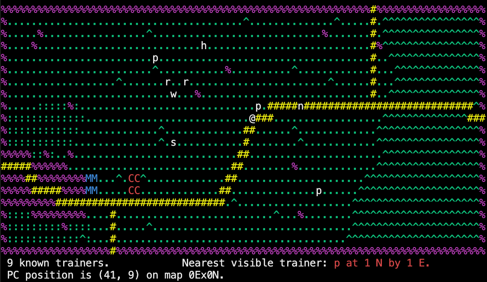

INSTALLATION: Download and unpack tar.gz file to chosen directory, CD into directory, run "make", run ./poke327

START GAME: Press any of the below controls for NPC's to spawn in and begin the game.

CONTROLS: 7/y: Move one cell to the upper left. 8/k: Move one cell up. 9/u: Move one cell to the upper right. 6/l: Move one cell to the right. 3/n: Move one cell to the lower right: 2/j: Move one cell down. 1/b: Move one cell to the lower left. 4/h: Move one cell to the left. t: Show trainer locations on map. esc: return to previous screen. Q: Quit game.

PokeMart/PokeCenter: Move into 'M' or 'C' cell and press '>' to enter. Escape button to leave -> To enter new map run through an exit.

FLYING: To fly around the map press "f" and the flying prompt will appear. Enter your first coordinate followed by enter and then the second coordinate followed by enter!

As you enter the long grass, pokemon will start to appear which will show in your terminal. As you get further and further away from your origin, you will face higher level pokemon!

